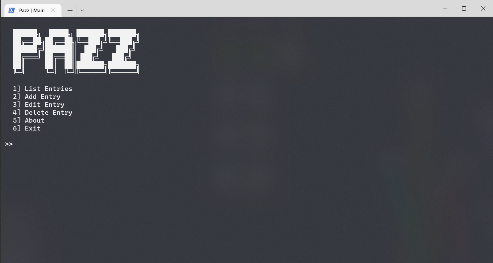

```
██████╗  █████╗ ███████╗███████╗
██╔══██╗██╔══██╗╚══███╔╝╚══███╔╝
██████╔╝███████║  ███╔╝   ███╔╝
██╔═══╝ ██╔══██║ ███╔╝   ███╔╝ 
██║     ██║  ██║███████╗███████╗
╚═╝     ╚═╝  ╚═╝╚══════╝╚══════╝
```

A cli-based password manager and generator written in Python using SQLite for database. Passwords are encrypted with AES-256 with a key derived from a master password for secure storage and retrieved by copying to the user's clipboard.

*This password manager is a more sophisticated and partial rewrite of another [project](https://github.com/waterrmalann/CBSE-XII-CS-PROJECT) I've made in the past.*

# Features

- Add, edit, delete, and list password entries.
- AES-256 encrypted storage of passwords.
- Generation of extremely secure passwords using 4 available generators.
- Copy to/from clipboard.
- SQL based local storage using SQLite.

## Dependencies

- [pyperclip](https://pypi.org/project/pyperclip/) (*Copy and paste clipboard functions*)
- [pycryptodome](https://pypi.org/project/pycryptodome) (*Cryptographic functions*)



---

## 🚀 Setup

1. [Clone the repository](https://docs.github.com/en/github/creating-cloning-and-archiving-repositories/cloning-a-repository-from-github/cloning-a-repository). 

```sh
git clone https://github.com/waterrmalann/pazz.git
```

2. Install the requirements.txt.

```sh
python -m pip install -r requirements.txt
```

3. Run the project.
```sh
python program.py
```

---

###  To-Do

- Cross-platform compatibility.
- Export data as `.csv` file.
- Menu for changing master password.
- Ability to keep multiple profiles with separate databases.
- Automatically check passwords against database breaches. 
- Password strength checker.
- ~~Strong password generator.~~
- Follow best practices and make everything more secure.

### ⚠️ Word of Warning

When it comes to security, honestly I don't have much idea what is it that I'm doing with the encryption part and all so there *may* be vulnerabilities, though I'm pretty certain that the password manager is *secure enough* as the entries are still AES-256 encrypted (maybe improperly but still..) and locally stored. Sorry not sorry.

### 🤝 Contribution

Contributions are always accepted. Feel free to open a pull request to fix any issues or to make improvements you think that should be made. You could also help me with the to-do list above. Any contribution will be accepted as long as it doesn't stray too much from the objective of the app. If you're in doubt about whether the PR would be accepted or not, you can always open an issue to get my opinion on it.

License
----

This project is licensed under the permissive **MIT License**, see [LICENSE](LICENSE)